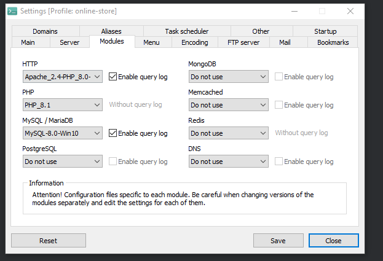
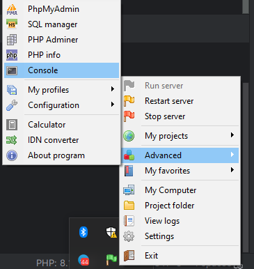

Guide for clone repo and install laravel on Open Server

Clone repo into domains cd OSPanel\domains

`git clone https://github.com/KarbovskyiV/Mobe.git` 

Going to settings into OSPanel and choose it and run server

After that go to OSPanel console 

 
in console going inside project, type: 
`cd domains\Mobe\back-end`

and here type: `composer install`

create .env file and copy all settings from .env.example

Create db with name 'mobe' wherever you want

After it in OSPanel console type: `php artisan migrate` - it's create DB 

